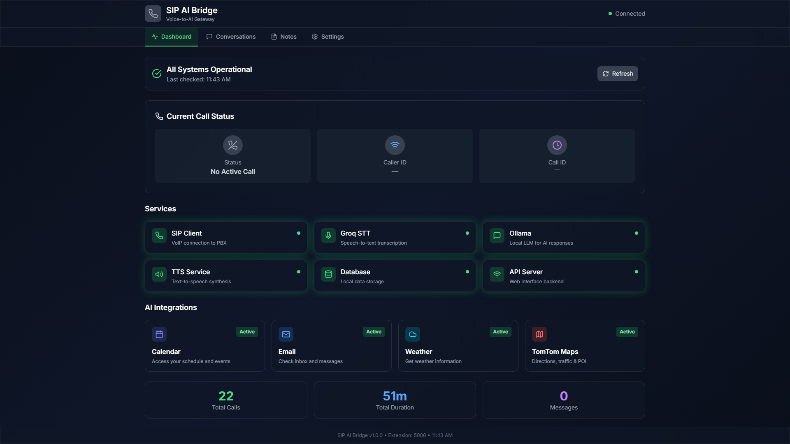
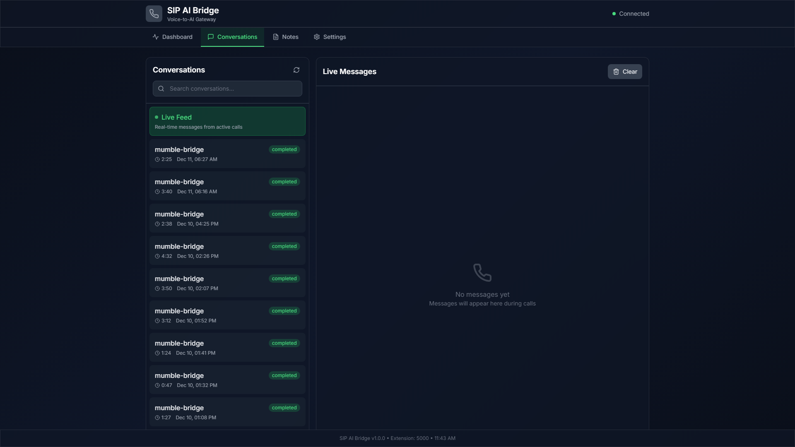
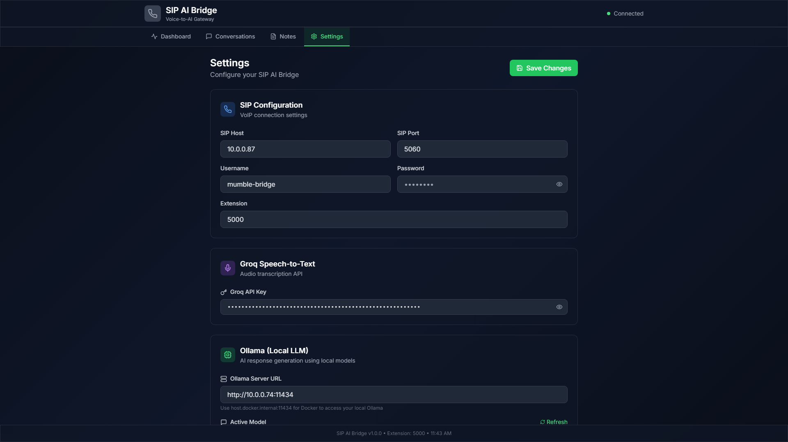
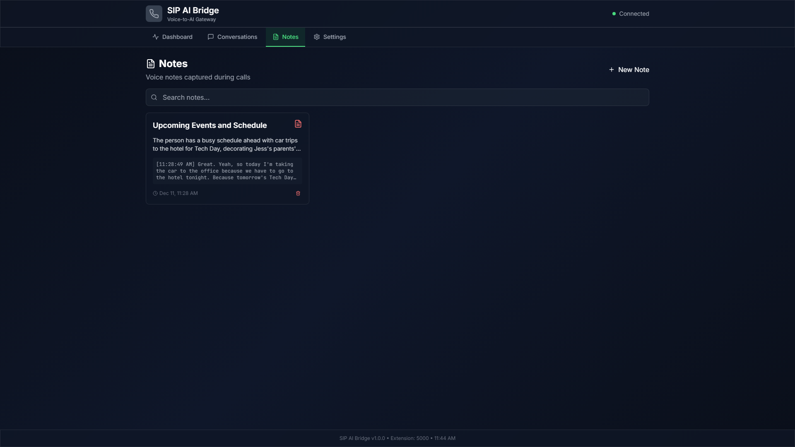

# SIP AI Bridge

A Docker-based SIP voice bridge that connects VoIP calls to AI services for intelligent voice interactions.

## Features

- **SIP Integration**: Connects to any SIP-compatible PBX on a configurable extension
- **Speech-to-Text**: Uses Groq's Whisper API for fast, accurate transcription
- **AI Responses**: Integrates with local Ollama instance for intelligent responses with automatic Groq LLM fallback
- **Text-to-Speech**: Uses openai-edge-tts for natural voice synthesis
- **Web Dashboard**: Real-time monitoring and configuration interface
- **Persistent Storage**: SQLite database for conversation history and settings
- **Calendar Integration**: Access and query your calendar events during calls
- **Email Integration**: Check your inbox on-demand during calls via IMAP
- **Weather Integration**: Get current weather and forecasts for any location via OpenWeatherMap
- **Conversation History**: Browse and export past conversations
- **Real-time Updates**: WebSocket-based live updates during calls

## Architecture

```
┌─────────────────────────────────────────────────────────────────┐
│                     Docker Container                             │
│  ┌──────────────┐    ┌──────────────┐    ┌──────────────────┐  │
│  │  SIP Client  │───▶│ Flask Backend│◀──▶│  React Frontend  │  │
│  │  (PJSUA2)    │    │  + WebSocket │    │  (Port 3002)     │  │
│  │  Port 5060   │    │  Port 5001   │    └──────────────────┘  │
│  └──────────────┘    └──────────────┘                          │
└─────────────────────────────────────────────────────────────────┘
         │                   │                   │
         ▼                   ▼                   ▼
    ┌─────────┐        ┌─────────┐        ┌─────────────┐
    │ SIP PBX │        │  Groq   │        │ Ollama + TTS │
    └─────────┘        │(STT+LLM)│        │  (Primary)  │
                       └─────────┘        └─────────────┘
                                            (falls back
                                             to Groq LLM)
```

## Quick Start

### Prerequisites

- Docker and Docker Compose
- Groq API key (for speech-to-text)
- Running Ollama instance
- Running TTS service (openai-edge-tts)

### Configuration

1. Copy the environment template and edit with your settings:

```bash
cp .env.example .env
# Edit .env with your actual values
```

2. Configure the `.env` file:

```bash
# Groq API (for speech-to-text and LLM fallback)
GROQ_API_KEY=your_groq_api_key_here
GROQ_LLM_MODEL=llama-3.1-8b-instant  # LLM model for fallback (optional)

# SIP Configuration
SIP_HOST=your_sip_server_ip
SIP_PORT=5060
SIP_USERNAME=mumble-bridge
SIP_PASSWORD=your_sip_password
SIP_EXTENSION=5000

# Ollama (local LLM)
# Use host.docker.internal to access host's Ollama from Docker
OLLAMA_URL=http://host.docker.internal:11434
OLLAMA_MODEL=llama3.1

# TTS Service (openai-edge-tts)
TTS_URL=http://your_tts_server_ip:5050
TTS_API_KEY=your_api_key_here
TTS_VOICE=en-US-GuyNeural

# Timezone (optional, defaults to UTC)
# Set the timezone for date and time displays throughout the application
# Examples: America/New_York, Europe/London, Asia/Tokyo, etc.
TIMEZONE=UTC

# Calendar Integration (optional)
# iCalendar (.ics) feed URL for calendar access
# Get from Google Calendar, Outlook, or other calendar services
CALENDAR_URL=https://api.calendar.com/feed.ics

# Email Integration (optional, IMAP)
# For checking emails during calls
EMAIL_ADDRESS=your.email@gmail.com
EMAIL_APP_PASSWORD=your_app_password_here
EMAIL_IMAP_SERVER=imap.gmail.com
EMAIL_IMAP_PORT=993

# Weather Integration (optional, OpenWeatherMap)
# For weather information during calls
OPENWEATHER_API_KEY=your_openweather_api_key_here

# Bot Persona (optional)
# Customize the AI's personality and response style
BOT_PERSONA=You are a friendly AI assistant on a phone call. Keep your responses short, conversational, and to the point.
```

### Running with Docker Compose

```bash
# Build and start the container
docker-compose up -d

# View logs
docker-compose logs -f

# Stop the container
docker-compose down
```

### Accessing the Web Interface

Once running, access the web dashboard at:

- **Web UI**: http://localhost:3002
- **API**: http://localhost:5001

## Visual Guide

### Dashboard

The main dashboard provides real-time monitoring of all services and call activity:



The dashboard shows:
- Service health status for all integrated services
- Current call status and controls
- Recent call activity
- AI integration services (Calendar, Email, Weather, TomTom)

### Conversations

Browse and review past conversations with pagination support:



Features include:
- Paginated conversation list (10 per page)
- Search functionality
- Real-time message updates during active calls
- Export conversations to text files

### Settings

Configure all aspects of the SIP AI Bridge:



#### SIP Configuration


Configure your SIP server connection, extension, and credentials.

#### Calendar Integration


Set up your iCalendar feed URL for calendar access during calls.

#### Email Integration


Configure IMAP settings for on-demand email checking during calls.

#### Weather Integration


Add your OpenWeatherMap API key for weather information.

### Notes

Manage notes and reminders:



Create, edit, and organize notes that can be referenced during calls.

## Web Interface

### Dashboard

- Real-time service health monitoring
- Current call status and controls
- Recent activity logs
- Quick statistics

### Conversations

- Live message feed during calls
- Historical conversation browser with pagination
- Export conversations to text files
- Search and filter capabilities
- Real-time message updates via WebSocket

### Calendar

- View upcoming events from your calendar
- Ask the AI about your schedule during calls
- Automatic context injection for calendar-aware responses
- Support for Google Calendar, Outlook, iCloud, and other iCalendar feeds

### Email

- Check unread emails on-demand during calls
- Gmail App Password support
- IMAP integration for multiple email providers
- Privacy-focused: emails are not permanently stored

### Weather

- Automatic weather detection when users ask about weather
- Current weather conditions for any location
- Weather forecasts (optional)
- Supports multiple temperature units (Fahrenheit, Celsius, Kelvin)
- Natural voice-formatted weather responses

### Settings

- SIP server configuration
- API keys management (Groq, TTS)
- Voice selection for TTS
- Service endpoint configuration
- Timezone configuration (can be set in UI or .env file)
- Calendar URL configuration
- Email IMAP settings
- Weather API key configuration
- Bot persona customization

## API Endpoints

### Health & Status

- `GET /api/health` - Health check for all services
- `GET /api/status` - Current bridge status

### Configuration

- `GET /api/config` - Get current configuration
- `POST /api/config` - Update configuration
- `GET /api/voices` - List available TTS voices

### Conversations

- `GET /api/conversations` - List conversations (supports pagination)
- `GET /api/conversations/:call_id` - Get specific conversation
- `GET /api/messages` - Get recent messages

### Calendar

- `GET /api/calendar/test` - Test calendar connection and fetch events
- `GET /api/calendar/events` - Get upcoming calendar events

### Email

- `GET /api/email/test` - Test email connection and fetch unread emails
- `GET /api/email/unread` - Get unread emails (query param: `limit`)

### Weather

Weather functionality is automatically integrated into the AI conversation flow. When users ask about weather, the system:
- Detects weather-related keywords in speech
- Extracts location from the query
- Fetches current weather from OpenWeatherMap
- Injects weather context into AI responses

### SIP Control

- `POST /api/sip/restart` - Restart SIP client
- `POST /api/sip/hangup` - Hang up current call

### Testing

- `POST /api/test/transcribe` - Test transcription with audio file
- `POST /api/test/ollama` - Test Ollama with text
- `POST /api/test/tts` - Test TTS synthesis

## Development

### Local Development

```bash
# Backend
cd backend
pip install -r requirements.txt
python -m app.main

# Frontend
cd frontend
npm install
npm run dev
```

### Building the Docker Image

```bash
docker build -t sip-ai-bridge .
```

### Project Structure

```
Sip-Bridge/
├── backend/              # Python Flask backend
│   ├── app/
│   │   ├── main.py      # Flask app and API endpoints
│   │   ├── sip_client.py # SIP client (PJSUA2)
│   │   ├── gpt_client.py # Ollama/Groq LLM client
│   │   ├── transcription.py # Groq Whisper transcription
│   │   ├── tts_client.py # Text-to-speech client
│   │   ├── calendar_client.py # Calendar integration
│   │   ├── email_client.py # Email IMAP integration
│   │   ├── weather_client.py # Weather integration (OpenWeatherMap)
│   │   ├── database.py  # SQLite database models
│   │   ├── websocket.py  # WebSocket manager
│   │   └── config.py    # Configuration management
│   └── requirements.txt
├── frontend/             # React + TypeScript frontend
│   ├── src/
│   │   ├── components/  # React components
│   │   ├── hooks/       # Custom React hooks
│   │   └── utils/       # Utility functions
│   └── package.json
├── data/                 # Persistent data (database, recordings)
├── logs/                 # Application logs
├── docs/                 # Additional documentation
└── docker-compose.yml    # Docker Compose configuration
```

## Services Integration

### Groq (Speech-to-Text & LLM Fallback)

**Speech-to-Text**: Uses Groq's Whisper Large V3 model for transcription:
- API Docs: https://console.groq.com/docs/api-reference#audio-transcription
- Fast, accurate speech-to-text conversion
- Supports multiple audio formats (WAV recommended)

**LLM Fallback**: Automatically used when Ollama is unavailable:
- Same API key as transcription (no additional setup needed)
- Default model: `llama-3.1-8b-instant` (configurable)
- Seamless fallback ensures calls continue even if local Ollama fails
- Fast cloud-based responses

### Ollama (AI Responses - Primary)

Local LLM integration:
- Website: https://ollama.com
- Usage: `POST /api/generate` or `POST /api/chat`
- Default model: llama3.1 (configurable)
- Accessible from Docker via `host.docker.internal:11434`
- **Automatic Fallback**: If Ollama is unavailable, automatically falls back to Groq LLM API

### openai-edge-tts (Text-to-Speech)

OpenAI-compatible TTS endpoint:
- GitHub: https://github.com/travisvn/openai-edge-tts
- Endpoint: `POST /v1/audio/speech`
- Multiple voice options available
- Natural-sounding voice synthesis

### Calendar Services

iCalendar (.ics) feed integration:
- Works with Google Calendar, Outlook, iCloud, and other providers
- Automatic event fetching and context injection
- 15-minute caching for performance
- See [Calendar Integration Guide](docs/CALENDAR_INTEGRATION.md) for details

### Email Services (IMAP)

IMAP email integration:
- Gmail App Password support
- Works with Outlook, Yahoo, iCloud, and other IMAP providers
- On-demand email checking during calls
- See [Email Integration Guide](docs/EMAIL_INTEGRATION.md) for details

### Weather Services (OpenWeatherMap)

OpenWeatherMap API integration:
- Website: https://openweathermap.org/api
- Free tier available (1,000 calls/day)
- Automatic weather detection in conversations
- Current weather and forecast support
- Supports city names and "city,country" format
- Multiple temperature units (imperial, metric, standard)
- Weather data is automatically injected into AI context when users ask about weather

## Documentation

Additional detailed documentation is available in the `docs/` directory:

- [Calendar Integration Guide](docs/CALENDAR_INTEGRATION.md) - Setup and usage for calendar features
- [Email Integration Guide](docs/EMAIL_INTEGRATION.md) - IMAP email setup and configuration
- [Dashboard Updates](docs/DASHBOARD_UPDATES.md) - Recent UI improvements
- [Conversation Pagination](docs/CONVERSATION_PAGINATION_UPDATE.md) - Pagination features
- [Call Status Fix](docs/CALL_STATUS_FIX.md) - Status handling improvements

## Troubleshooting

### SIP Not Registering

1. Check SIP credentials in `.env`
2. Verify network connectivity to PBX
3. Check firewall allows UDP port 5060
4. View logs: `docker-compose logs -f`
5. Ensure DNS resolution is working (container uses custom DNS servers)

### Transcription Failing

1. Verify Groq API key is valid
2. Check audio format (WAV, 16kHz recommended)
3. Ensure network access to api.groq.com
4. Check Docker logs for transcription errors

### TTS Not Working

1. Verify TTS API key is configured
2. Check TTS service is running and accessible
3. Test endpoint: `POST /api/test/tts`
4. Verify TTS_URL is correct (use `host.docker.internal` if TTS is on host)

### AI Responses Not Working

1. Verify Ollama is running and accessible
2. Check OLLAMA_URL is correct (use `host.docker.internal` from Docker)
3. Test endpoint: `POST /api/test/ollama`
4. Verify model is available: `curl http://localhost:11434/api/tags`
5. **Automatic Fallback**: If Ollama fails, the system automatically uses Groq LLM (requires `GROQ_API_KEY`)
6. Check logs to see which provider was used: `docker-compose logs | grep llm`
7. Configure Groq LLM model (optional): Set `GROQ_LLM_MODEL` in `.env` (default: `llama-3.1-8b-instant`)

### Calendar Not Working

1. Verify calendar URL is correct and accessible
2. Ensure URL uses `https://` (not `webcal://`)
3. Test endpoint: `GET /api/calendar/test`
4. Check that calendar feed is publicly accessible
5. See [Calendar Integration Guide](docs/CALENDAR_INTEGRATION.md) for details

### Email Not Working

1. Verify email credentials are configured
2. For Gmail, ensure you're using an App Password (not regular password)
3. Check IMAP server and port settings
4. Test endpoint: `GET /api/email/test`
5. See [Email Integration Guide](docs/EMAIL_INTEGRATION.md) for details

### Weather Not Working

1. Verify OpenWeatherMap API key is configured in Settings
2. Check that the API key is valid and has available quota
3. Ensure location names are spelled correctly (e.g., "New York", "London,UK")
4. Check Docker logs for weather API errors: `docker-compose logs | grep weather`
5. Weather is automatically triggered when users ask about weather - no manual API calls needed
6. Get a free API key at https://openweathermap.org/api

### Web Interface Not Loading

1. Check that port 3002 is not in use by another service
2. Verify Docker container is running: `docker-compose ps`
3. Check container logs: `docker-compose logs sip-bridge`
4. Ensure frontend was built: `cd frontend && npm run build`

## License

MIT License - See LICENSE file for details.

